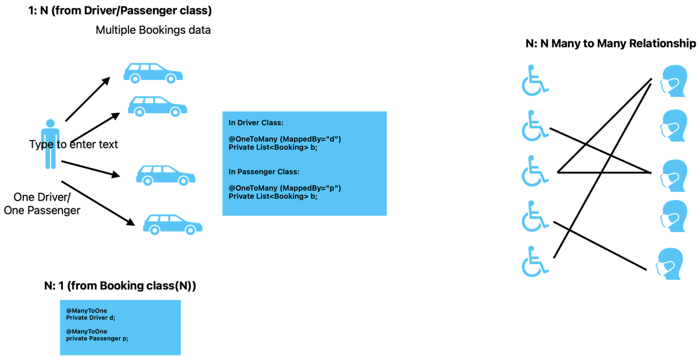

# Getting Started

### Reference Documentation
For further reference, please consider the following sections:

* [Official Gradle documentation](https://docs.gradle.org)
* [Spring Boot Gradle Plugin Reference Guide](https://docs.spring.io/spring-boot/3.3.2/gradle-plugin)
* [Create an OCI image](https://docs.spring.io/spring-boot/3.3.2/gradle-plugin/packaging-oci-image.html)

### Additional Links
These additional references should also help you:

* [Gradle Build Scans – insights for your project's build](https://scans.gradle.com#gradle)

******
### NOTES:

Custom Error Handling: using wildcard in ResponseEntity.

**RequestParam:**

Generally RP kept optional. we can use required=false, default value if we are operating on the param, like here.
```` java 
@GetMapping
    public ResponseEntity<List<Todo>> getTodos(@RequestParam(required = false,defaultValue = "true") boolean isCompleted){
        return ResponseEntity.status(HttpStatus.OK).body(
                todos.stream().filter(a->a.isCompleted()==isCompleted).collect(Collectors.toUnmodifiableList()));
    }
````
If anyone sends null value?? then.     
"status": 400,
"error": "Bad Request",

Need to handle it. Change primitive boolean to Object Boolean.
Scenario: if no param is sent in url, then isCompleted obj has null. (default value is not there here)
Then we can do a null check on the object
```` java 
@GetMapping
    public ResponseEntity<List<Todo>> getTodos(@RequestParam(required = false /*,defaultValue = "true"*/) Boolean isCompleted){
    if(null==isCompleted)
        return '____';
    return ResponseEntity.status(HttpStatus.OK).body(
                todos.stream().filter(a->a.isCompleted()==isCompleted).collect(Collectors.toUnmodifiableList()));
    }
````

**CREATE OUR OWN ANNOTATIONS:**

About Aspect Oriented Programming:

Note: @Override: is discarded at compiling/running. It is just for documentation purpose. So it comes under @Retention(RetentionPolicy.SOURCE)

CREATE OUR OWN ANNOTATIONS:

1) Create an annotation Interface
2) Create custom properties for this annotation
   Add meta-annotations to specify the scope and the target
    - Applicable on what?  -Target:s field, method, class? -@Target
    - Retention policy- @RetentionPolicy
3) Define the implementation:
    - Annotate with @Aspect
    - Write the functionality of that annotation here.
    - Annotate with @Component: So that spring can handle its object when used in various classes.
    - Using Advice type(@Before, @After, @Around), Point Cut, Join points: implement the logic.

#### SPRING MVC:

1) **Controller**: it collects the user request from view and provide it to the models. Models given response, it collects and send it to the view (User)
2) **DTO**: It defines the API contract, to transfer the object (of data) between layers.
3) **DAO** : Same as Repo layer. For Data base interaction.
4) **Hibernate, ORM**: select * from -> product.getAll(); Executing DB queries, instead of writing query, we write through Object Oriented way : through methods.

**HIBERNATE, ORM & JPA**

1) **JDBC**->Driver manager Era
2) **JPA: Java Persistence API**
   JPA is a specification for accessing, persisting & managing data between java objects & relational tables.
3) **ORM:**
   https://medium.com/javarevisited/jpa-annotations-overview-cfdcfdb913f4
4) **Hibernate ORM:**

DDL : Data definition language
Configuring to update/create/read/create-drop on running the Application everytime.

Once we include JPA & driver dependencies, we need to mention datasource config compulsorily.

Why 2 tables will be created when we have @GeneratedValue(strategy=GenerationType.SEQUENCE)
Why a second table?
* Hibernate can create a separate table (e.g., hibernate_sequence) if your database does not support sequences natively or
  if Hibernate is configured to handle sequences in its own way.
* The table-based sequence generator (called TABLE strategy in some contexts) is a fallback mechanism that Hibernate uses
  to simulate sequences for databases that don't support them.

```java 
@Entity(name="bookingReviewEntity")
@Table(name="bookingReview") //booking_review
public class Review{}

@Entity(name="bookingReviewEntity") //booking_review_entity
@Table
public class Review{}

@Entity
@Table
public class Review{} //review
```

**JPA Inheritance:**

Table A: a,b,c1,c2,d ; Table B: f,e,c1,c2,g
Creating 2 entities having c1,c2 is each: Boiler code.

Gather it and keep it in a separate **abstract class** . And extend that class in your entity class.
Why abstract? - so that no once can instantiate it.

All this is done at object level Inheritance. SQL doesn't understand it. JPA Should handle it.
JPA- How this inheritance to be handled? How JPA should handle this inheritance and co relate to SQL tables.
Solution: **@MappedSuperClass**


**JPA COMPOSITION:**

```java
@Entity
public class Booking extends BaseModel {

        @OneToOne
        private Review review;

        //To specify it as a enum attribute. If not specified, it takes default ORDINAL
        @Enumerated(value= EnumType.STRING) //By default(ORDINAL) tinyInt it takes
        private BookingStatus bookingStatus;

        @Temporal(value=TemporalType.TIMESTAMP)
        private Date startTime;

        @Temporal(value=TemporalType.TIMESTAMP)
        private Date endTime;

        private Long totalDistance;

}
```

```
Hibernate: alter table booking add column review_id bigint
Hibernate: create table driver_review (driver_review_comment varchar(255), driver_review_id bigint not null, primary key (driver_review_id)) engine=InnoDB
Hibernate: create table rider_review (rider_rating varchar(255), rider_review_comment varchar(255), rider_review_id bigint not null, primary key (rider_review_id)) engine=InnoDB
Hibernate: alter table booking drop index UK2c57floc70nhp4ehcsn9ctr71
Hibernate: alter table booking add constraint UK2c57floc70nhp4ehcsn9ctr71 unique (review_id)
Hibernate: alter table booking add constraint FKh1stionm0jgsyfg7fv98trhjj foreign key (review_id) references booking_review (id)
Hibernate: alter table driver_review add constraint FKnu3riro2219q477fo4ipa1nqk foreign key (driver_review_id) references booking_review (id)
Hibernate: alter table rider_review add constraint FKgkdkw7827wy2uhf5frej3t6pt foreign key (rider_review_id) references booking_review (id)
```

```
desc booking;
+------------------+--------------------------------------------------------------------------------------+------+-----+---------+----------------+
| Field            | Type                                                                                 | Null | Key | Default | Extra          |
+------------------+--------------------------------------------------------------------------------------+------+-----+---------+----------------+
| id               | bigint                                                                               | NO   | PRI | NULL    | auto_increment |
| created_at       | datetime(6)                                                                          | NO   |     | NULL    |                |
| updated_at       | datetime(6)                                                                          | NO   |     | NULL    |                |
| booking_status   | enum('ASSIGNING_DRIVER','CAB_ARRIVED','CANCELLED','COMPLETED','IN_RIDE','SCHEDULED') | YES  |     | NULL    |                |
| end_time         | datetime(6)                                                                          | YES  |     | NULL    |                |
| start_time       | datetime(6)                                                                          | YES  |     | NULL    |                |
| total_distance   | bigint                                                                               | YES  |     | NULL    |                |
| driver_review_id | bigint                                                                               | YES  | UNI | NULL    |                |
| review_id        | bigint                                                                               | YES  | UNI | NULL    |                |
+------------------+--------------------------------------------------------------------------------------+------+-----+---------+----------------+
9 rows in set (0.00 sec)

```

**1:N & N:1 and mappedBy Concept:**
```
Hibernate: create table booking (id bigint not null auto_increment, created_at datetime(6) not null, updated_at datetime(6) not null, booking_status enum ('ASSIGNING_DRIVER','CAB_ARRIVED','CANCELLED','COMPLETED','IN_RIDE','SCHEDULED'), end_time datetime(6), start_time datetime(6), total_distance bigint, driver_id bigint, review_id bigint, rider_id bigint, primary key (id)) engine=InnoDB
Hibernate: create table booking_review (id bigint not null auto_increment, created_at datetime(6) not null, updated_at datetime(6) not null, content varchar(255) not null, rating float(53), primary key (id)) engine=InnoDB
Hibernate: create table driver (id bigint not null auto_increment, created_at datetime(6) not null, updated_at datetime(6) not null, license_number varchar(255), name varchar(255), primary key (id)) engine=InnoDB
Hibernate: create table driver_review (driver_review_comment varchar(255), driver_review_id bigint not null, primary key (driver_review_id)) engine=InnoDB
Hibernate: create table rider (id bigint not null auto_increment, created_at datetime(6) not null, updated_at datetime(6) not null, name varchar(255), primary key (id)) engine=InnoDB
Hibernate: create table rider_review (rider_rating varchar(255), rider_review_comment varchar(255), rider_review_id bigint not null, primary key (rider_review_id)) engine=InnoDB
Hibernate: alter table booking drop index UK2c57floc70nhp4ehcsn9ctr71
Hibernate: alter table booking add constraint UK2c57floc70nhp4ehcsn9ctr71 unique (review_id)
Hibernate: alter table driver drop index UK9yq25nknyh5y5gihylet1ypy9
Hibernate: alter table driver add constraint UK9yq25nknyh5y5gihylet1ypy9 unique (license_number)
Hibernate: alter table booking add constraint FKd3n9h18mu017cxfopghwkri7s foreign key (driver_id) references driver (id)
Hibernate: alter table booking add constraint FKh1stionm0jgsyfg7fv98trhjj foreign key (review_id) references booking_review (id)
Hibernate: alter table booking add constraint FK4sr0ragyfupkbymd84g9sip04 foreign key (rider_id) references rider (id)
Hibernate: alter table driver_review add constraint FKnu3riro2219q477fo4ipa1nqk foreign key (driver_review_id) references booking_review (id)
Hibernate: alter table rider_review add constraint FKgkdkw7827wy2uhf5frej3t6pt foreign key (rider_review_id) references booking_review (id)
```

Booking, Driver & Passenger table:
Scenario- A passenger can have a multiple Bookings data. A Driver can have a multiple bookings data.



In Uber application:

A driver can have multiple passengers; (Through a bookings)
A passenger can have rides with many drivers; (Through a bookings)
Here Booking table already working as a Through/Joint Table.
With little modifications, we can represent it as Many:Many

```
Hibernate: create table course (id bigint not null auto_increment, created_at datetime(6) not null, updated_at datetime(6) not null, name varchar(255), rool_no varchar(255), primary key (id)) engine=InnoDB
Hibernate: create table course_students (student_id bigint not null, course_id bigint not null) engine=InnoDB
Hibernate: create table student (id bigint not null auto_increment, created_at datetime(6) not null, updated_at datetime(6) not null, name varchar(255), rool_no varchar(255), primary key (id)) engine=InnoDB
Hibernate: alter table course_students add constraint FKgut5xj4l8sk6hg3l0t2su2pnc foreign key (course_id) references course (id)
Hibernate: alter table course_students add constraint FK61ry13vjip2yrapfiag3mt9pq foreign key (student_id) references student (id)
```
[SPRING JPA QUERY METHODS: Guidelines](https://docs.spring.io/spring-data/jpa/reference/repositories/query-methods-details.html)

FETCH TYPES:
Eg: Instagram posts loading, set by set.
Lazy Mode
Eager Mode
It is declared with the mappedBy tag:

```java
@OneToMany (mappedBy = "driver", fetch= FetchType.EAGER)
    private List<Booking> bookings=new ArrayList<>();
 ```
Eager-
```
select d1_0.id,d1_0.created_at,d1_0.license_number,d1_0.name,d1_0.updated_at,b1_0.driver_id,b1_0.id,b1_0.booking_status,b1_0.created_at,b1_0.end_time,
r1_0.id,case when r1_1.driver_review_id is not null then 1 when r1_2.rider_review_id is not null then 2 when r1_0.id is not null then 0 end,r1_0.content,
r1_0.created_at,r1_0.rating,r1_0.updated_at,r1_1.driver_review_comment,r1_2.rider_rating,r1_2.rider_review_comment,r2_0.id,r2_0.created_at,r2_0.name,
r2_0.updated_at,b1_0.start_time,b1_0.total_distance,b1_0.updated_at from driver d1_0 left join booking b1_0 on d1_0.id=b1_0.driver_id
 left join (booking_review r1_0 left join driver_review r1_1 on r1_0.id=r1_1.driver_review_id left join rider_review r1_2 on r1_0.id=r1_2.rider_review_id) 
 on r1_0.id=b1_0.review_id left join rider r2_0 on r2_0.id=b1_0.rider_id where d1_0.id=?
```
Lazy-
```
select b1_0.id,b1_0.booking_status,b1_0.created_at,b1_0.driver_id,b1_0.end_time,b1_0.review_id,b1_0.rider_id,b1_0.start_time,b1_0.total_distance,b1_0.updated_at from booking b1_0 where b1_0.driver_id=?
select r1_0.id,r1_0.created_at,r1_0.name,r1_0.updated_at from rider r1_0 where r1_0.id=?
```

When complex tables are there, associations involved.
Then recommendation to use: @Query
* RAW Query - @Query(nativeQuery=true,value="raw_query")
* Hibernate Query

Note:
**@Modifying** queries that provides us with the number of updated entities.
[About @Modifying](https://www.baeldung.com/spring-data-jpa-modifying-annotation)


#### Various ways of writing Queries
1) JPQL (Java Persistence Query Lang)
   ```java
   @Query("SELECT d FROM Driver d where d.id= :id AND d.licenseNumber= :lNumber")//if any error, CTErr comes. Better, robust
   Optional<Driver> rawFindByIdAndLicenseNumberV2(Long id, String lNumber);
   ```
2) Native Query (Raw queries)
   ```java
   @Query(nativeQuery = true, value="SELECT * FROM Driver where id= :id AND license_Number= :lNum") //error thrown at RT, use iff only complex queries.
    Optional<Driver> rawFindByIdAndLicenseNumber(@Param("id") Long id,@Param("lNum") String lNumber); //After Java 8+ @param to be used.
   ```
3) Hibernate Query
   ```java
   default List<User> findByNameUsingHQL(String name){
    Session session=entityManager.unwrap(Session.class);
    Query q=session.createQuery("From user u where u.name= :name");
    q.setParameter("name",name);
    return q.getResultList();
   }
   ```
4) ORM Methods using Repositories
   Using JPA providing in-built methods.

#### L30: Famous Interview questions

**(N+1) Problems**

List of driver_id : {1,3,4,5,6}
Get all the bookings of each drivers.

```text
    for(Long d_id : list)
    {
        Driver d = dRepo.getById(d_id);
        List<Booking> bookings = bRepo.getAllBookingsByDriverId(d_id);
        public List<Booking> getBookings() {
        return bookings;
        }
    }
```

```text
//'N+1 Problem'
    List<Driver> drivers=dRepo.getAllByIdIn(List<Long> driver_ids); // Select * from Driver where id in [1,2,4,5,6]; Count=1
    for(Driver dd: drivers){
        dd.getBooking();  //Count:N, if we have 'N' drivers
        }
       //Total : (N+1) Queries we have executed.
```


**N+1 Problems**

Solve by,
1) Using JPA in-built methods
2) Using Fetch Mode( In @OneToMany declared class field) - Transactional in service layer on the fetching method.

**DB VERSIONING:**
Convention: resources/db/migration/V1...,V2.... sql files are kept.
To create init file: Choose Flyway init Migration option
To propagate the changes to DB via Script (SQL script written in Flyway): select Flyway Versioned Migration
FileName can start have V2__add_ßPhNumber_To_Driver.sql
To propagate to the DB: Run the project.

**DB RollBack:**
flyway undo: One stepback Rollback only.
For some x step's done changes to undo: say I'm at V5 of DV. need to undo V3 changes.
Not ideal choice: V5>V4>`V3. No

We need to undo only V3. DO manual migration steps only. Need to drollback script.
Eg: ALTER TABLE DRIVER DROP COLUMN address;

Liquibase & Flyway:+ JPA Buddy: Tool
As we're basically writing SQL, we need not have the tool.

**CASCADE TYPES**
PERSIST, MERGE, REMOVE, REFRESH, DETACH, ALL

**ADAPTER DESIGN PATTERN**
When we need to make drastic changes in our product due to some other requirements.
2 or more incompatible interfaces or classes can't work together. Adapter pattern helps in enabling this.


